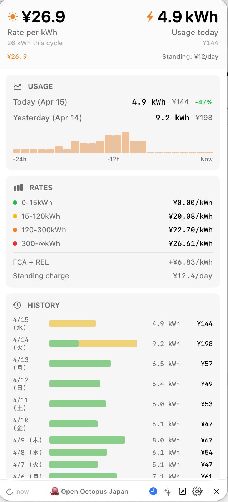

# 🐙 Open Octopus Japan

> **Unofficial** open-source toolkit for [Octopus Energy Japan](https://octopusenergy.co.jp) customers.
> Not affiliated with or endorsed by Octopus Energy.

<p align="center">
  
</p>

## Download

**[Download the latest release](https://github.com/Greatdane/open-octopus-japan/releases/latest)** — macOS app (Apple Silicon / ARM64 only)

1. Download `OpenOctopusJapan-x.x.x-arm64.dmg`
2. Open the DMG and drag **OctopusMenuBar** to Applications
3. On first launch: right-click the app → **Open** (required for unsigned apps)
4. Create `~/.octopus.env` with your credentials (see [Configuration](#configuration))

> Requires macOS on Apple Silicon (M1/M2/M3/M4). Intel Macs are not currently supported.

## What's Included

| Component | Directory | Description |
|-----------|-----------|-------------|
| **Menu Bar App** | `macos/` | Native macOS menu bar app — live rate, daily usage, tiered pricing, history, billing cycle insights |
| **CLI Tools** | `cli/` | Terminal commands for account, usage, tariff, supply points, billing cycle, and more |
| **Python Client** | `cli/` | Async GraphQL client library for the Octopus Energy Japan API |

## Menu Bar App

The macOS menu bar app shows your electricity data at a glance:

- **Live marginal rate** — billing-cycle-aware (shows your actual current tier, not the max)
- **Daily usage** — today vs yesterday with cost estimates using tiered pricing
- **Tiered rate breakdown** — all consumption tiers with colour-coded dots + FCA + REL
- **Usage history** — daily bar chart with tier-coloured segments (green/yellow/orange/red)
- **Billing cycle insights** — cycle start date, cost so far, kWh used, days remaining, projected bill
- **AI assistant** — ask questions about your energy usage (off by default, requires Anthropic API key)
- **Auto-recovery** — restarts the Python bridge after sleep or unexpected termination

### Building the App

```bash
# 1. Install the Python backend
cd cli
pip install -e ".[all]"

# 2. Build the macOS app
cd ../macos
open OctopusMenuBar.xcodeproj
# Then Cmd+R in Xcode to build and run
```

The app requires `octopus-server` (installed with the Python package) to communicate with the Octopus Energy API.

## CLI Commands

```bash
# Account & tariff
octopus account        # Account balance and details
octopus tariff         # Tariff breakdown with tiered rates, FCA, REL
octopus supply         # Supply point and meter details
octopus agreements     # Current and past agreements
octopus status         # Balance, current rate, and billing cycle info

# Usage
octopus usage          # Daily consumption (last 7 days)
octopus usage -d 30                            # Last 30 days
octopus usage --start 2026-02-15 --end 2026-03-01  # Date range

# Dashboard
octopus tui            # Interactive terminal dashboard
```

### AI Assistant

```bash
octopus-ask "What's my balance?"
octopus-ask "How much did I use yesterday?"
octopus-ask "What's my electricity rate?"
```

Requires `ANTHROPIC_API_KEY` in `~/.octopus.env`.

## Installation

```bash
cd cli
pip install -e ".[all,dev]"
```

### Configuration

Create `~/.octopus.env` with your Octopus Energy Japan credentials:

```bash
OCTOPUS_EMAIL=your-email@example.com
OCTOPUS_PASSWORD=your-password
ANTHROPIC_API_KEY=sk-ant-xxxxx  # Optional, for AI features
```

## Project Structure

```
open-octopus-japan/
├── cli/                          # Python package + CLI
│   ├── pyproject.toml
│   ├── src/open_octopus/         # Library source
│   └── tests/                    # Unit + integration tests
├── macos/                        # macOS menu bar app
│   ├── OctopusMenuBar/           # App shell
│   ├── OctopusMenuBarPackage/    # SwiftUI views + Python bridge
│   ├── OctopusMenuBar.xcodeproj/ # Xcode project
│   └── Config/                   # Build configurations
└── docs/
    ├── japan-api-reference.md    # Complete Japan GraphQL API reference
    └── menubar.png               # Menu bar app screenshot
```

## Python Client Library

```python
from open_octopus import OctopusClient

async with OctopusClient(email="user@example.com", password="xxx") as client:
    account = await client.get_account()
    tariff = await client.get_tariff()
    readings = await client.get_consumption(periods=48)
    daily = await client.get_daily_usage(days=7)
    supply_points = await client.get_supply_points()
    agreements = await client.get_agreements()
    areas = await client.get_postal_areas("100-0001")  # Public, no auth
```

## API Coverage

| Endpoint | Status |
|----------|--------|
| Account info & balance | Working |
| Consumption (half-hourly) | Working |
| Tariff & rates (tiered) | Working |
| Supply points & meters | Working |
| Agreements | Working |
| Postal areas (public) | Working |
| Product switch (mutation) | Client method only |
| Amperage change (mutation) | Client method only |

See [docs/japan-api-reference.md](docs/japan-api-reference.md) for the complete Japan GraphQL API reference, including:
- `ElectricitySteppedProduct` — tiered pricing with kWh step ranges
- Japan-specific fields: `fuelCostAdjustment`, `renewableEnergyLevy`
- Which endpoints work and which are unavailable on the Japan API

## Development

```bash
cd cli
pytest                                          # Run tests
ruff check src/ tests/                          # Lint
mypy src/open_octopus/ --ignore-missing-imports # Type check
```

## License

MIT
