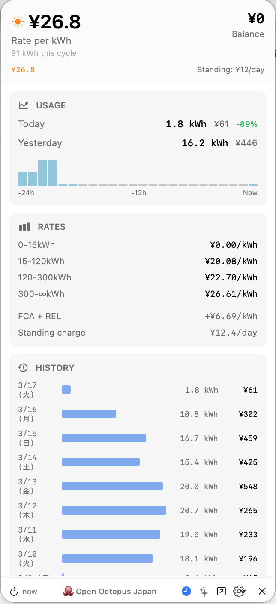

# 🐙 Open Octopus Japan

> **Unofficial** open-source toolkit for [Octopus Energy Japan](https://octopusenergy.co.jp) customers.
> Not affiliated with or endorsed by Octopus Energy.



## What's Included

| Component | Description |
|-----------|-------------|
| **Python Client** | Async GraphQL client for the Octopus Energy Japan API |
| **CLI Tools** | Terminal commands for account, usage, tariff, billing, and more |
| **TUI** | Interactive terminal dashboard with live updates |
| **AI Assistant** | Ask questions about your energy usage in natural language |
| **Menu Bar App** | Native macOS app *(coming soon)* |

## CLI Commands

```bash
# Account & billing
octopus account        # Account balance and details
octopus tariff         # Tariff breakdown (base rate, FCA, REL)
octopus supply         # Supply point and meter details
octopus agreements     # Current and past agreements
octopus billing        # Recent billing transactions

# Usage
octopus usage          # Daily consumption (last 7 days)
octopus usage -d 30                            # Last 30 days
octopus usage --start 2026-02-15 --end 2026-03-01  # Date range
octopus usage --start 2026-02-15               # From date to today

# Browse & explore
octopus products                # Available electricity plans
octopus products -p 100-0001   # Plans for your postcode
octopus loyalty                 # Loyalty points (if available)

# Dashboard
octopus status         # Quick overview of balance and current rate
octopus tui            # Interactive terminal dashboard
```

### AI Assistant (octopus-ask)
```bash
octopus-ask "What's my balance?"
octopus-ask "How much did I use yesterday?"
octopus-ask "What's my electricity rate?"
octopus-ask "What plans are available?"
```

## Installation

```bash
pip install -e ".[all,dev]"
```

### Configuration

Set your Octopus Energy Japan credentials:

```bash
# Create ~/.octopus.env
OCTOPUS_EMAIL=your-email@example.com
OCTOPUS_PASSWORD=your-password
ANTHROPIC_API_KEY=sk-ant-xxxxx  # Optional, for AI features
```

Or use environment variables:
```bash
export OCTOPUS_EMAIL="your-email@example.com"
export OCTOPUS_PASSWORD="your-password"
```

## Python Client

```python
from open_octopus import OctopusClient

async with OctopusClient(email="user@example.com", password="xxx") as client:
    # Account
    account = await client.get_account()
    print(f"Balance: ¥{account.balance:.0f}")

    # Consumption
    readings = await client.get_consumption(periods=48)
    daily = await client.get_daily_usage(days=7)

    # Tariff & rates
    tariff = await client.get_tariff()
    rate = client.get_current_rate(tariff)

    # Supply points & agreements
    supply_points = await client.get_supply_points()
    agreements = await client.get_agreements()

    # Public queries (no auth required)
    areas = await client.get_postal_areas("100-0001")
```

## API Coverage

| Endpoint | Status | CLI Command |
|----------|--------|-------------|
| Account info & balance | Working | `octopus account` |
| Consumption (half-hourly) | Working | `octopus usage` |
| Tariff & rates | Working | `octopus tariff` |
| Supply points & meters | Working | `octopus supply` |
| Agreements | Working | `octopus agreements` |
| Postal areas (public) | Working | — |
| Billing transactions | Not available on Japan API | `octopus billing` |
| Available products | Not available on Japan API | `octopus products` |
| Loyalty points | Not available on this account | `octopus loyalty` |
| Planned dispatches | Client method only | — |
| Communication prefs | Client method only | — |
| Product switch (mutation) | Client method only | — |
| Amperage change (mutation) | Client method only | — |

## Development

```bash
# Run tests
pytest

# Lint
ruff check src/ tests/

# Type check
mypy src/open_octopus/ --ignore-missing-imports
```

## Supported Tariffs (Japan)

- グリーンオクトパス (Green Octopus)
- シンプルオクトパス (Simple Octopus)
- Other Japan electricity tariffs

## License

MIT

## Credits

Built with Python and SwiftUI. AI powered by [Claude](https://anthropic.com).
